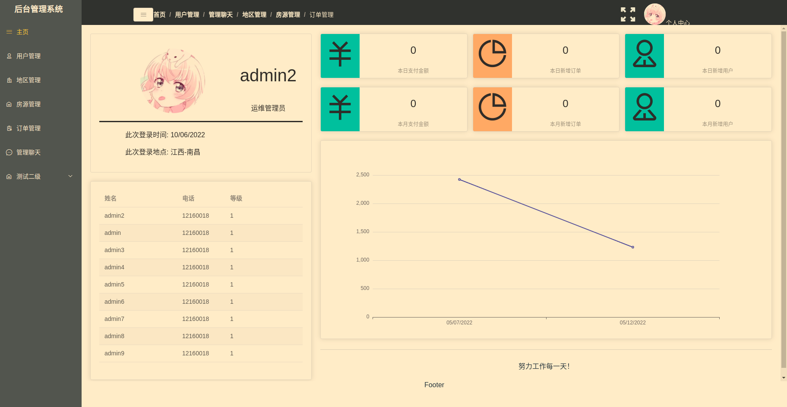
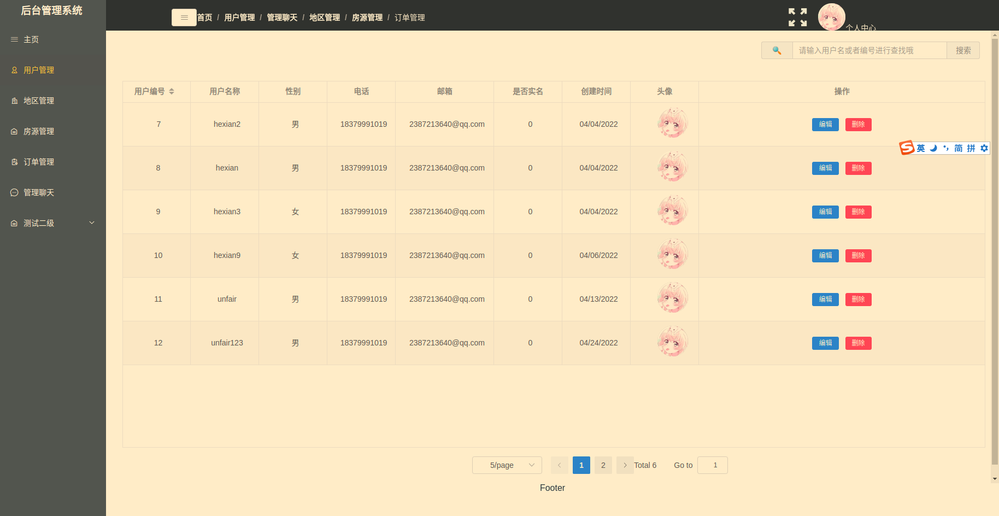
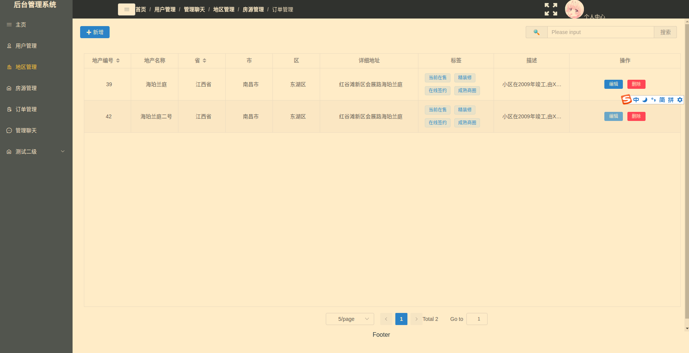
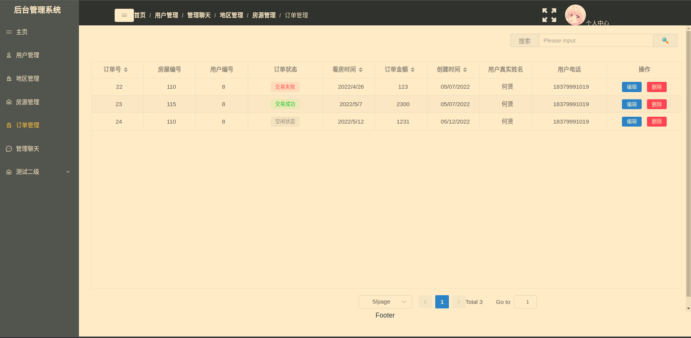
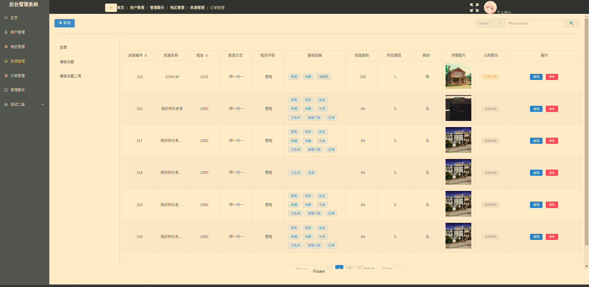
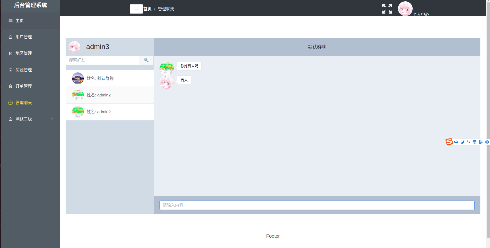

# 民宿租赁后台管理系统

## 前言
> 以前提交得仓库太乱了，还是要整理一下
--------------


整个项目分为两部分：前台展示项目，以及后台管理接口。其中后台接口共60多个。涉及登陆、注册、添加地区、添加房产、购买订单、用户中心等、构成一个**比较完整**的流程（微信小程序非企业级无法使用支付功能。）

**注：此项目纯属个人YY，不用于任何商业用途。原型借鉴了墨刀在素材广场提供的原型图**

## 说明

----


> 如果您对此项目感兴趣，可以点"Star"支持一下！谢谢！

> 开发环境 Ubuntu20.04 nodejs12.16.1  Mongodb5.0.5

> 部署环境 阿里云 Ubuntu20.04 LTS 64位

> 有问题也不要来问我 O(∩_∩)O哈哈哈~ 

> 小程序相关项目地址： [点击这里](https://github.com/hexianWeb/RentalFrontEnd)

## 技术栈

---------------

### 后台接口平台技术栈


```bash
nodejs + express + mongodb +mongoose +es6/7 
```

### 后台展示平台技术栈

```
vue3 + vuex + vue-router + webpack + ES6/7 + less + element-ui
```


## 项目运行

----

项目运行之前，请确保系统安装了以下应用

1. node
2. mongodb(开启状态)
3. GraphicsMagick（裁剪图片)


接口平台

```
git clone https://github.com/hexianWeb/RentalSystemBackend

cd backend

npm install 

nodemon ./app.js

访问: http://localhost:3001 (如果已启动前台程序，则不需要打开此地址)
```


展示平台

```
cd ./frontend
npm install 
npm run serve
//访问： http://localhost:8001 即可
```


### 后台管理系统仓库网址

### 部分截图

#### 部分后台管理系统截图













## 项目布局

### Backend布局

```
├── app.js				入口文件
├── config				运行配置
│   └── default.js		
├── controller			处理中心，负责路由及数据库的具体操作
│   ├── admin			管理员
│   │   └── admin.js
│   ├── email			邮件通知
│   │   └── email.js
│   ├── estate			地区管理
│   │   └── estate.js
│   ├── house			房源管理
│   │   └── house.js
│   ├── ids
│   │   └── ids.js
│   ├── spect			订单管理
│   │   └── spect.js
│   └── user			用户管理
│       └── user.js
├── data				初始化数据
│   ├── admins
│   ├── emails
│   ├── estates
│   ├── houses
│   ├── ids
│   ├── sessions
│   ├── spects
│   └── users
├── logs				日志
│   ├── error.log
│   └── success.log
├── middlewares			中间件	
│   ├── check.js		权限验证
│   └── formMiddleWare.js
├── mission.txt
├── models
│   ├── admin			管理员模型
│   │   └── admin.js
│   ├── email			
│   │   └── email.js
│   ├── estate			地区模型
│   │   └── estate.js
│   ├── house			房产模型
│   │   └── house.js
│   ├── ids.js
│   ├── spect			订单模型
│   │   └── spect.js
│   └── user			用户模型
│       └── user.js
├── mongodb				连接数据库
│   └── db.js
├── package.json
├── prototype
│   └── baseproto.js
├── ReadMe.md
├── routes				路由配置
│   ├── admin.js
│   ├── email.js
│   ├── estate.js
│   ├── house.js
│   ├── ids.js
│   ├── index.js
│   ├── spect.js
│   └── user.js
├── schema				数据验证
│   ├── admin
│   │   └── admin.js
│   ├── email
│   │   └── email.js
│   └── user
│       └── user.js
├── test.html
├── test.js
└── util				工具类
    ├── cut_pic.js		图片等比例裁剪
    ├── email_content	邮件模板
    │   └── register_user.js
    ├── emailSender.js	邮件发送
    ├── map				地区定位
    │   └── getLocation.js
    └── socket			
        └── index.js
```


### Frontend布局

```
├── babel.config.js
├── header.html
├── jsconfig.json
├── package.json
├── package-lock.json
├── public
│   ├── favicon.ico
│   ├── img
│   │   ├── bg_house1.jpg
│   │   ├── bg_house.png
│   │   └── google-chrome-stable_current_amd64.deb
│   └── index.html
├── README.md
├── src
│   ├── api				
│   │   ├── index.js		API接口
│   │   └── request.js		axios封装
│   ├── App.vue
│   ├── components
│   │   ├── Brand				
│   │   │   └── index.vue
│   │   ├── ChatTable		聊天模块
│   │   │   ├── chatAside.vue
│   │   │   ├── chatFooter.vue
│   │   │   ├── chatMain.vue
│   │   │   └── index.vue
│   │   ├── CommonTable		表单展示模块
│   │   │   └── index.vue
│   │   ├── EstateForm		地区信息填写与修改
│   │   │   └── index.vue
│   │   ├── HouseForm		房屋信息填写与修改
│   │   │   └── index.vue
│   │   ├── Lang			中英转换
│   │   │   └── index.vue
│   │   ├── SrceenFull		全屏模块
│   │   │   └── index.vue
│   │   ├── TypeNav			
│   │   │   └── index.vue
│   │   ├── UploadAvatar	
│   │   │   └── index.vue
│   │   └── UserForm
│   │       └── index.vue
│   ├── config
│   │   └── index.js
│   ├── hooks
│   │   ├── index.js
│   │   └── websocket.js
│   ├── i18n
│   │   ├── en.js
│   │   ├── index.js
│   │   └── zh.js
│   ├── main.js
│   ├── plugins
│   │   └── io.js
│   ├── router				路由配置
│   │   ├── index.js
│   │   └── router_table.js
│   ├── store				vueX
│   │   ├── brand
│   │   │   └── index.js
│   │   ├── chat
│   │   │   └── index.js
│   │   ├── home
│   │   │   └── index.js
│   │   ├── index.js
│   │   └── module
│   │       └── home.js
│   └── views
│       ├── Chat
│       │   └── index.vue
│       ├── Estate
│       │   └── index.vue
│       ├── Home
│       │   └── index.vue
│       ├── House
│       │   └── index.vue
│       ├── Login
│       │   └── index.vue
│       ├── Main.vue
│       ├── Spect
│       │   └── index.vue
│       └── User
│           └── index.vue
└── vue.config.js
```

